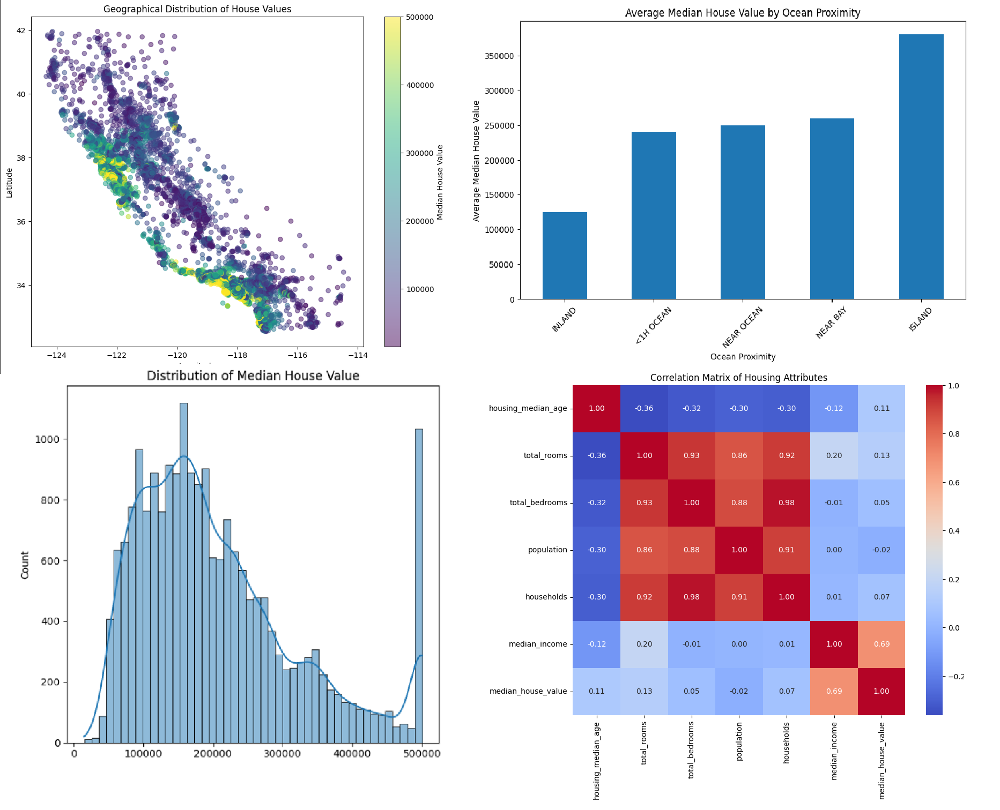
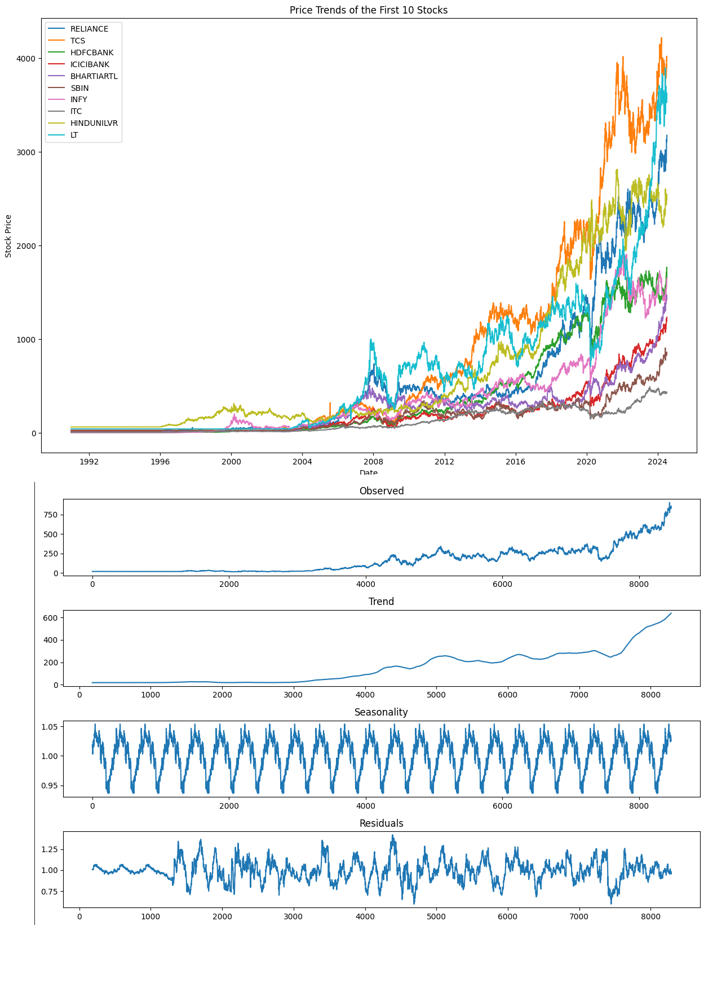

# Data Analyst Portfolio
This repository is used to demonstrate data analytics approaches for problems solving

- [x] **Python:** 
  - **Housing Value Prediction in California** 
*Project Plan:* **[HERE](https://github.com/YenchiSomnambule/Data_Analyst_Portfolio/blob/main/Housing%20Value%20Prediction%20in%20California%20Project%20Plan.docx)** 
*Exploratory Data Analysis:* **[HERE](https://github.com/YenchiSomnambule/Data_Analyst_Portfolio/blob/main/Housing%20Value%20Prediction%20in%20California%20Exploratory%20Data%20Analysis.ipynb)** 
*Data Preparation:* **[HERE](https://github.com/YenchiSomnambule/Data_Analyst_Portfolio/blob/main/Housing%20Value%20Prediction%20in%20California%20Data%20Preparation.ipynb)** 

  - **NSE Historical Stock Price Analysis** 
*Data Analysis:* **[HERE](https://github.com/YenchiSomnambule/Data_Analyst_Portfolio/blob/main/nse_stock_historical_price_data_analysis.ipynb)** 

